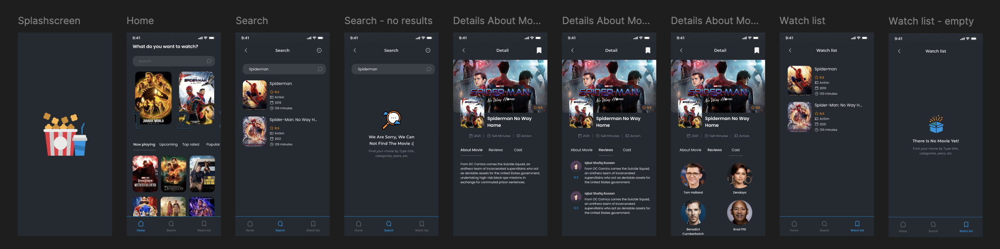

# GhibliX

**GhibliX** is a cross-platform mobile app built with **Kotlin/Compose Multiplatform Mobile (CMM)** using **Jetpack Compose**. The app presents a beautifully designed catalog of Studio Ghibli movies using the [Studio Ghibli API](https://ghibliapi.vercel.app/).

---

## ✨ Features

- 📽️ Browse a list of Studio Ghibli movies
- 📝 View detailed information including director, release year, and description
- 🔍 Search functionality to quickly find your favorite titles
- 📱 Built for Android and iOS using Compose Multiplatform
- 🎨 Elegant UI based on an open-source Figma design

---

## 🛠 Tech Stack

- **UI Framework**: Jetpack Compose Multiplatform (CMM)
- **Languages**: Kotlin (Android), Swift (iOS)
- **Networking**: Ktor Client
- **State Management**: Kotlin Coroutines + StateFlow
- **Architecture**: MVI
- **Design Source**: [Studio Ghibli App UI on Figma](https://www.figma.com/community/file/1124835379376527920)
